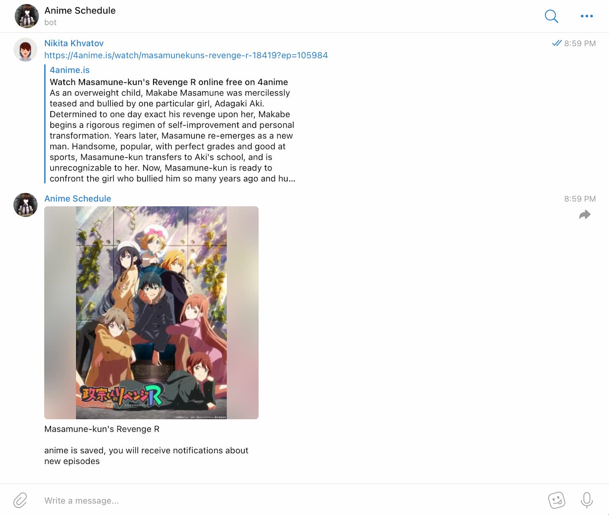

# Anime Sentry

## Operation principle

- You send the bot a link to an anime.
- The bot mentions the release time of the episode.
- The bot checks every half hour, according to the cron schedule, whether a new anime episode has been released (with voice acting or subtitles).
- You can opt out of notifications for a specific anime, and the bot will stop notifying you about the release of new episodes.

## Supported websites

### English-language sites

- [4anime.is](https://4anime.is/)

### Russian-language sites

- [animego.org](https://animego.org/)
- [amedia.online](https://amedia.online/)
- [animevost.org](https://animevost.org/)



## Supported Languages

The bot currently supports the following languages:

- En (English) 🇬🇧
- Fr (French) 🇫🇷
- De (German) 🇩🇪
- Ru (Russian) 🇷🇺
- Es (Spanish) 🇪🇸
- Id (Indonesian) 🇮🇩
- It (Italian) 🇮🇹
- Ja (Japanese) 🇯🇵
- Ko (Korean) 🇰🇷
- Pt (Portuguese) 🇵🇹

## Local setup

- make env file (see .env.example)
- run script from Makefile

```sh
make dev 
```

## Production setup 

- run script from Makefile

```sh
make start
```

> it runs docker containers